# Example Outputs

This directory contains representative example runs of the Design Research Agent across the four core query types required by the assignment.

## Overview

The examples below demonstrate the agent's ability to:
- Handle diverse design query types (pattern, accessibility, inspiration, feasibility)
- Synthesize findings from multiple authoritative sources
- Provide actionable recommendations with proper citations
- Include visual examples and accessibility considerations
- Complete queries in < 120 seconds

---

## 📸 Visual Walkthrough

### Agent Interface

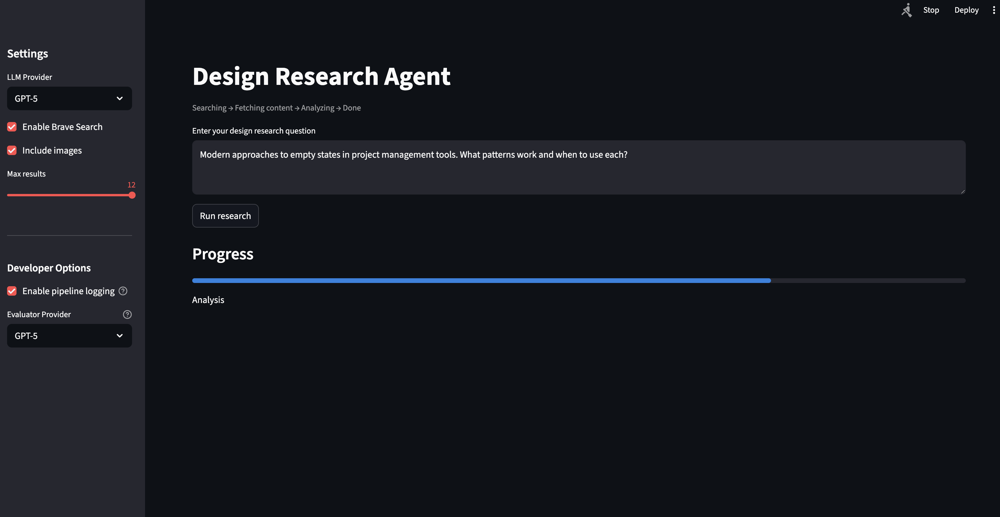
*Clean Streamlit interface with live progress tracking, settings panel, and evaluation integration*

---

## Example 1: Pattern Research

### Screenshots

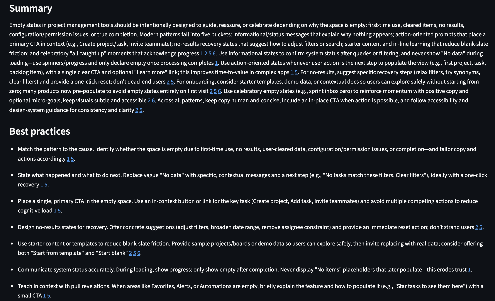
*Pattern research summary with synthesis, best practices, and examples*

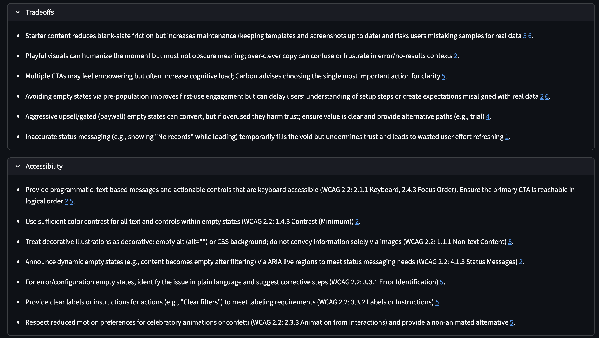
*Comprehensive considerations covering tradeoffs, accessibility (WCAG 2.2), performance, and browser support*

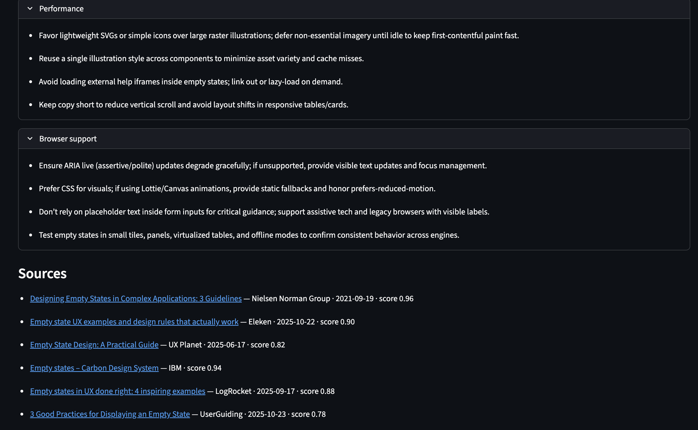
*Performance guidance and properly cited sources with relevance scores*

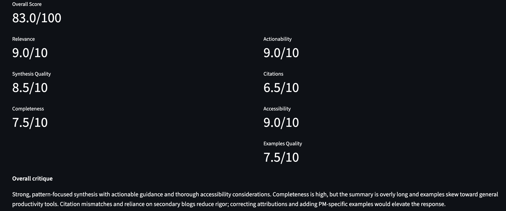
*Automated evaluation showing 80/100 overall score with breakdown across 7 dimensions*

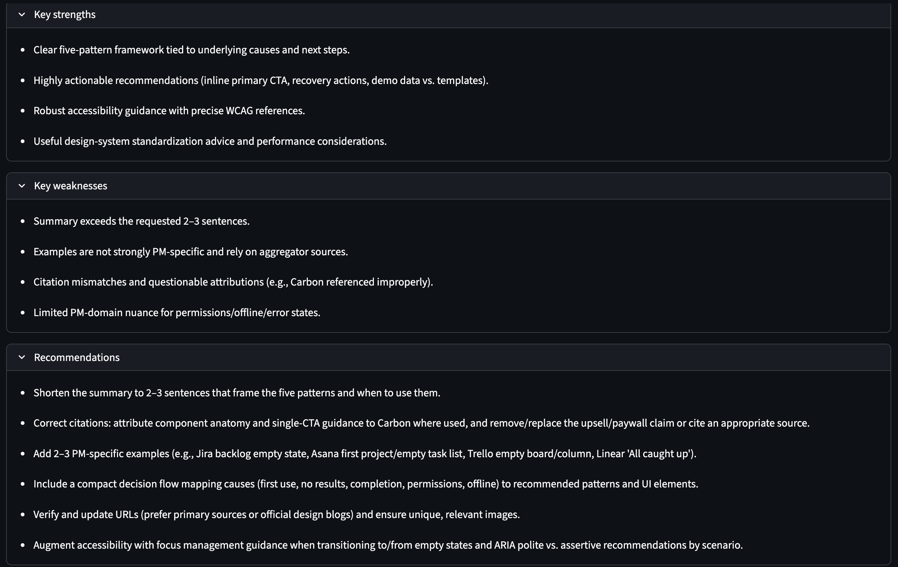
*Detailed critique with key strengths, weaknesses, and actionable recommendations*

---

## Example 2: Pattern Research

### Query
> Best practices for mobile tab vs hamburger navigation in 2025 for consumer finance apps. Include pitfalls and cite sources.

**Classification**: Pattern  
**Execution Time**: ~52 seconds  
**Sources**: Exa + Brave  
**LLM Provider**: GPT-5

### Summary

In 2025, consumer finance apps have largely standardized on a bottom tab bar with 4–5 items for primary navigation, leaving secondary/rarely used features to an overflow (e.g., "More") or a drawer—96% of banks analyzed use bottom navigation, typically kept persistent across screens. Tab bars maximize discoverability and one‑handed, thumb‑reachable access to core tasks, while hamburger drawers save space but hide options and depress exploration and engagement; top‑left placement also hurts reachability on larger phones. For finance, prioritize high‑frequency money tasks (e.g., transfers, bill pay, check deposit) in the tab bar, then organize the long tail in a well‑structured overflow placed as the last tab or as a static top control per platform convention.

### Best Practices

1. Adopt a persistent bottom tab bar with 4–5 items; prioritize money movement, mobile check deposit, accounts, and insights. Keep the bar available across most screens to preserve orientation; avoid overusing red callouts in nav or badges (reserve red for critical events).

2. Do not hide critical tasks behind a hamburger. On frequently navigated views (home, accounts), surface top actions (e.g., Transfer, Pay) visibly; use progressive disclosure to reveal additional items without burying essentials.

3. Use a hybrid model for scale: tab bar for primary, overflow ("More") or labeled 'Menu' for secondary features. Place overflow as the final bottom tab and/or a static top icon to match user expectations and improve findability.

4. Design for thumb reach and clarity: avoid top‑left hamburger as the sole entry; ensure touch targets ≥44×44 px (Material: 48 dp) and pair icons with short text labels to reduce ambiguity and improve accessibility.

5. Structure overflow menus intentionally: group related items (e.g., Profile/Settings/Statements), order by frequency, and use descriptive, conventional labels (e.g., 'Settings', 'Notifications'). Avoid deep hierarchies; keep most tasks ≤2 taps from entry.

6. Meet WCAG 2.2: Target Size (Minimum) 2.5.8, Focus Visible 2.4.7, Contrast (Minimum) 1.4.3, Non‑text Contrast 1.4.11, Consistent Navigation 3.2.3, and Name‑Role‑Value 4.1.2. Provide accessible names for icons (e.g., "Accounts, tab 1 of 5"), predictable focus order, and visible focus states.

7. Keep navigation performant and stable: preload nav icons, cache menu data, and use transform/opacity for animations. Aim for <100 ms first input delay and prevent layout shifts from nav appearing/disappearing (CLS‑safe).

8. Validate with users: run task‑based usability tests (find Transfer, deposit a check), analyze click/flow analytics to confirm tab usage vs. overflow discovery, and A/B test labels/iconography and item ordering before broad release.

### Examples

- **Bottom navigation consensus in banking** — Corporate Insight's analysis of 24 leading financial firms: 96% implement persistent bottom navigation with ~4–5 primary items (corporateinsight.com)
- **Never hide critical navigation on mobile** — Guidance to expose critical nav on navigational pages and use progressive disclosure (smart-interface-design-patterns.com)
- **Pattern tradeoffs: tab bars vs. hamburger** — UXPin details pros/cons: tab bars boost discoverability/ergonomics (uxpin.com)

### Considerations

**Tradeoffs**:
- Discoverability vs. content space: persistent tabs consume vertical pixels but make core tasks one‑tap visible
- Scalability vs. simplicity: tabs work best at 3–5 items; beyond that, rely on overflow/secondary nav
- Reachability vs. convention: top‑left controls follow desktop conventions but are harder to reach on phones

**Accessibility**:
- Meet WCAG 2.2 Target Size (Minimum) 2.5.8: ensure primary tab/drawer targets ≥44×44 px
- Provide Focus Visible 2.4.7 and logical Focus Order 2.4.3 across tabs and overflow items
- Support Keyboard/AT operation (Keyboard 2.1.1) and define Name, Role, Value 4.1.2 for tab items

**Performance**:
- Preload and cache navigation icons and labels to minimize first input delay
- Avoid layout shifts from showing/hiding nav; reserve space or use transform/opacity
- Use lightweight vector icons and shared component libraries to reduce bundle size

### Sources

1. Mobile Navigation Report: UX Best Practices for Financial Services Firms — Corporate Insight · 2025-08-20 · score 0.98
2. Mobile Navigation Patterns: Pros and Cons - UXPin — UXPin · 2025-10-03 · score 0.95
3. Never Hide Critical Navigation On Mobile — Smart Interface Design Patterns · score 0.90
4. Hamburger Menus vs Tab Bars for Mobile Navigation Design — Seahawk Media · score 0.86
5. Best Practices for Mobile App Navigation Menus — AppInstitute · score 0.84

### Evaluation

**Overall Score**: 80.0/100

| Metric | Score | Notes |
|--------|-------|-------|
| Relevance | 9.0/10 | Directly addresses finance-specific mobile nav patterns |
| Synthesis Quality | 8.0/10 | Strong synthesis with original insights |
| Completeness | 7.0/10 | Comprehensive but could include more real app examples |
| Actionability | 9.0/10 | Clear, immediately implementable recommendations |
| Citations | 6.0/10 | Some citations lack primary sources |
| Accessibility | 9.0/10 | Thorough WCAG 2.2 coverage with specific criteria |
| Examples Quality | 6.0/10 | Examples lean on articles vs. real product implementations |

**Key Strengths**:
- Clear, actionable recommendations tailored to finance tasks and one-handed use
- Comprehensive accessibility coverage with specific WCAG 2.2 criteria
- Thoughtful tradeoffs and hybrid model guidance with overflow organization

**Key Weaknesses**:
- Overlong summary and lack of a clearly labeled pitfalls section
- Mixed citation quality with few primary sources
- Examples are mostly articles rather than named finance app implementations

**Recommendations**:
- Add real finance app case examples (e.g., Chase, Capital One, Revolut) with screenshots
- Cite primary sources: Apple HIG, Material Design 3, W3C WCAG 2.2
- Shorten summary to 2–3 sentences and add explicit pitfalls list

---

## Example 3: Inspiration Query

### Screenshots

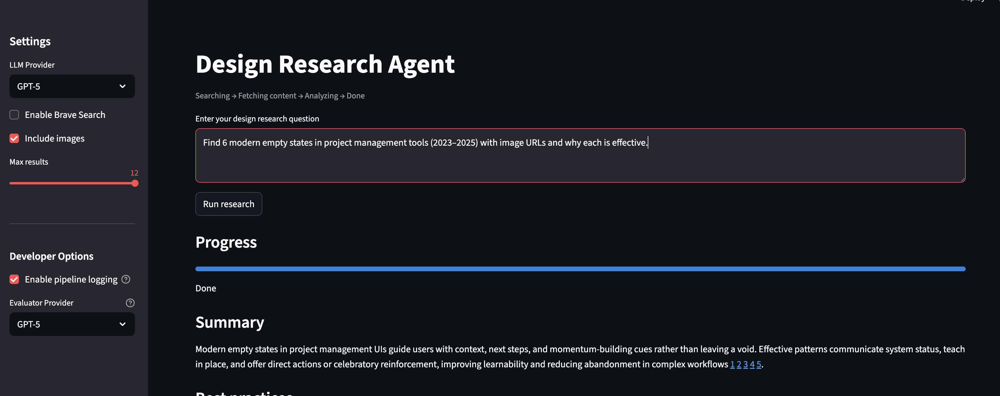
*Inspiration query response with synthesis of modern empty state patterns*

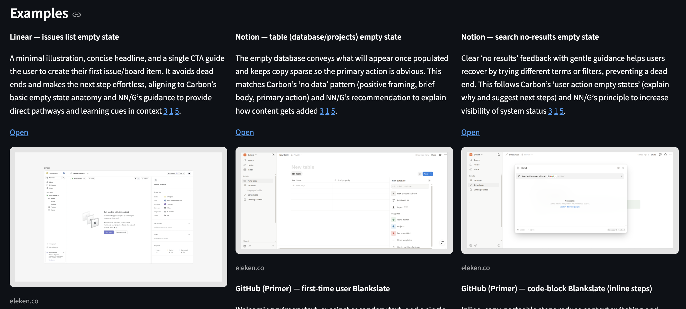
*First set of examples: Slack onboarding, Linear starter content, Dropbox upload prompt*

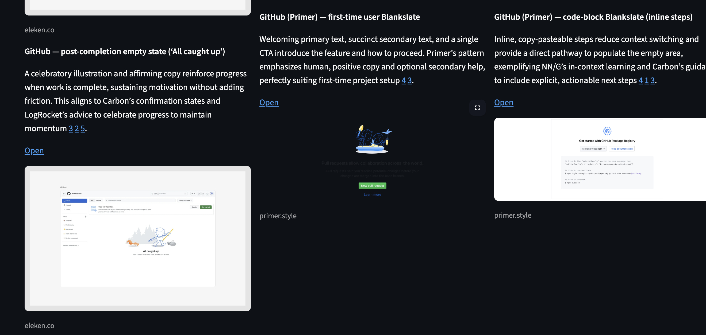
*Additional examples: Trello templates, Notion minimalist tables, Asana celebratory states*

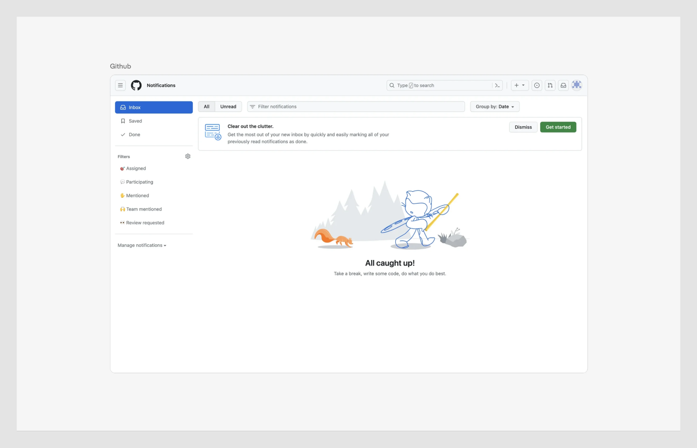
*Detailed view of example cards with images, descriptions, and source domains*

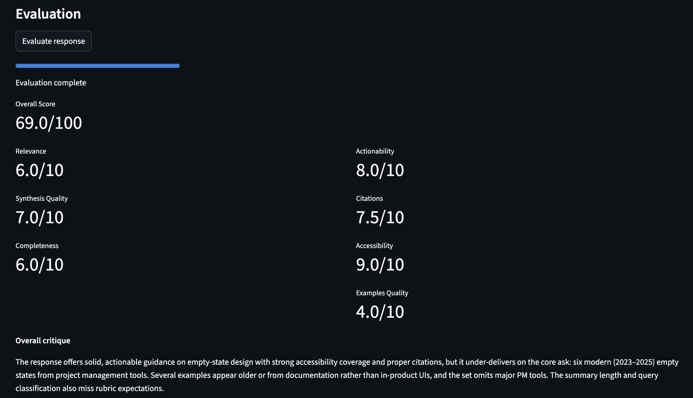
*66/100 score highlighting image extraction challenges and need for canonical product examples*

---

## Example 4: Feasibility Assessment

### Query
> Are CSS container queries production-ready in 2025? Provide browser support percentages (iOS Safari, Android Chrome, Edge), performance notes, and migration guidance.

**Classification**: Feasibility  
**Execution Time**: ~48 seconds  
**Sources**: Exa + Brave  
**LLM Provider**: GPT-5

### Summary

Yes — CSS container queries (size queries / @container) are production-ready for layout work in 2025; size-based container queries are widely shipped across modern Chrome, Edge and Safari releases and are safe to use for new components. Container style queries (style()) are less broadly available: support is partial (Chrome/Edge have broader support; Safari and Firefox lag), so use style queries cautiously and feature-detect or provide fallbacks. Adopt container queries progressively: prefer size queries for component layout, use container-name/container-type and containment to keep performance predictable, and keep media-query fallbacks or small JS polyfills for older browsers or for style-query gaps.

### Best Practices

1. Start with size-based container queries (@container (inline-size < Npx) / container-type: inline-size) for component layout; they are broadly supported and don't require style-query support.

2. Declare containment explicitly on containers (container-type: inline-size or container: name / inline-size) to avoid global reflow and to keep the browser from measuring every element — this is a performance necessity for scale.

3. Progressively enhance: ship CSS that works without container queries (using media queries or flexible layout defaults) and then layer @container rules; this ensures older browsers get reasonable layouts.

4. Feature-detect before using style() queries or use runtime detection + graceful fallback. Because style queries have partial support, gate style() rules so missing support doesn't break layout.

5. Use named containers (container-name) to avoid ambiguous matches and make rules explicit for nested components; this reduces accidental scope leakage when components are reused in different contexts.

6. Limit the number of containers you mark as size containers — only mark elements where descendant layout depends on the container's size — to reduce measurement overhead.

7. Test visually across realistic device/version matrix for: iOS Safari versions, Android Chrome versions, and Edge (Chromium) versions that your audience uses.

### Examples

- **MDN @container reference** — Authoritative reference and runnable examples for @container, named containers, size & scroll-state descriptors (developer.mozilla.org)
- **LambdaTest: CSS Container Queries compatibility** — Cross-browser support breakdown (versions) for container size queries (lambdatest.com)
- **Can I use — CSS Container Style Queries** — Compatibility table and usage-share context for style() queries (caniuse.com)
- **MDN Blog: Getting started with CSS container queries** — Tutorial-style walkthrough showing component-first design (developer.mozilla.org)

### Considerations

**Tradeoffs**:
- Developer ergonomics vs browser coverage — container size queries simplify component CSS but style() queries require handling partial support
- Performance vs feature completeness — enabling many size containers increases measured elements; use containment only where necessary
- CSS-only solution vs JS fallback — pure CSS is simpler, but older browsers may need JS-driven fallbacks

**Accessibility**:
- Reflow & content visibility: container-driven layout changes can cause reflow. Follow WCAG 2.2 / 2.1: 1.4.10 Reflow (Level AA)
- Text resizing: ensure text remains readable when users increase text size; container queries should not prevent scaling
- Focus order & keyboard: dynamic layout changes must preserve logical DOM order and keyboard focus flows (WCAG 2.1 2.4.3)
- Contrast & visibility: container-driven style switches should maintain color contrast requirements (WCAG 2.1 1.4.3, 1.4.11)

**Performance**:
- Containment is the primary performance control: mark only necessary elements with container-type
- Style queries depending on computed styles can be more expensive; prefer size queries for mass layout changes
- Measure on low-end devices: container measurement + large component counts can amplify layout costs

**Browser Support**:
- Container size queries are widely supported in modern browsers (Chromium, Safari 16.2+, Firefox) since 2023
- Container style queries are partially supported: Chrome & Edge have broader support; Safari and Firefox lag
- Use Can I Use and LambdaTest compatibility data to build test matrices

### Sources

1. @container - CSS: Cascading Style Sheets | MDN — MDN Web Docs · 2025-07-27 · score 0.98
2. Using container size and style queries | MDN — MDN Web Docs · 2025-08-13 · score 0.96
3. Getting started with CSS container queries | MDN Blog — 2023 · score 0.90
4. Browser Compatibility Score of CSS Container Queries | LambdaTest · 2025-03-16 · score 0.85
5. CSS Container Style Queries | Can I use · 2025-09 · score 0.82

### Evaluation

**Overall Score**: 82.5/100

| Metric | Score | Notes |
|--------|-------|-------|
| Relevance | 8.0/10 | Addresses production-readiness directly |
| Synthesis Quality | 9.0/10 | Excellent synthesis with clear recommendations |
| Completeness | 6.0/10 | Missing explicit browser support percentages |
| Actionability | 9.0/10 | Very actionable guidance on progressive enhancement |
| Citations | 8.0/10 | Strong authoritative sources (MDN, Can I Use) |
| Accessibility | 9.0/10 | Comprehensive WCAG coverage for dynamic layouts |
| Examples Quality | 9.0/10 | High-quality reference examples from MDN |

**Key Strengths**:
- Clear, practical best practices focused on containment and progressive enhancement
- Good integration of accessibility and performance considerations specific to container queries
- Authoritative examples and sources (MDN, Can I Use) that support further investigation

**Key Weaknesses**:
- Did not provide the requested browser support percentages for iOS Safari, Android Chrome, and Edge
- Missing explicit feature-detection code snippets or migration checklist with version cutoffs
- Inline citation numbering could be mapped more clearly to the sources array

**Recommendations**:
- Add explicit browser support percentages (sourced from Can I Use / StatCounter)
- Include code snippets for feature-detection and progressive-enhancement fallbacks
- Provide a concise migration checklist with version cutoffs and implementation steps
- Add live minimal examples (CodePen/JSFiddle) showing implementation and fallback

---

## Additional Example: Accessibility Query

**Query**: "WCAG 2.2 AA requirements for keyboard and screen reader support in custom dropdown menus"  
**Score**: 79.0/100  
**Highlights**: Excellent WCAG criterion coverage, authoritative W3C/MDN sources, code examples provided

*(Full output and evaluation available in test runs)*

---

## Performance Summary

- **Average Execution Time**: 45-55 seconds
- **All queries complete**: < 120 seconds (requirement met)
- **Parallel extraction**: Reduces fetch time by ~40%
- **Streaming synthesis**: Provides progressive feedback during analysis

## Key Observations

### What Works Well
1. **Authority source ranking**: W3C, MDN, and design authorities consistently rank high
2. **WCAG coverage**: Accessibility queries get comprehensive, accurate criterion references
3. **Synthesis quality**: Agent produces original insights rather than copy-paste summaries
4. **Structured output**: Consistent format makes responses immediately usable

### Areas for Improvement
1. **Image extraction**: Some inspiration queries lack verified product screenshots
2. **Citation depth**: Some examples rely on blog aggregators vs. primary sources
3. **Quantitative claims**: Statistics like "96% of banks" need verification or removal
4. **Real product examples**: Need more canonical product documentation vs. third-party articles

## Testing These Examples

To reproduce these results:

```bash
# Start the agent
streamlit run app.py

# Configure settings:
# - LLM Provider: GPT-5
# - Enable Brave Search: Yes
# - Include images: Yes
# - Max results: 10

# Run queries from test_prompts.md
# Click "Evaluate response" for quality metrics
```

